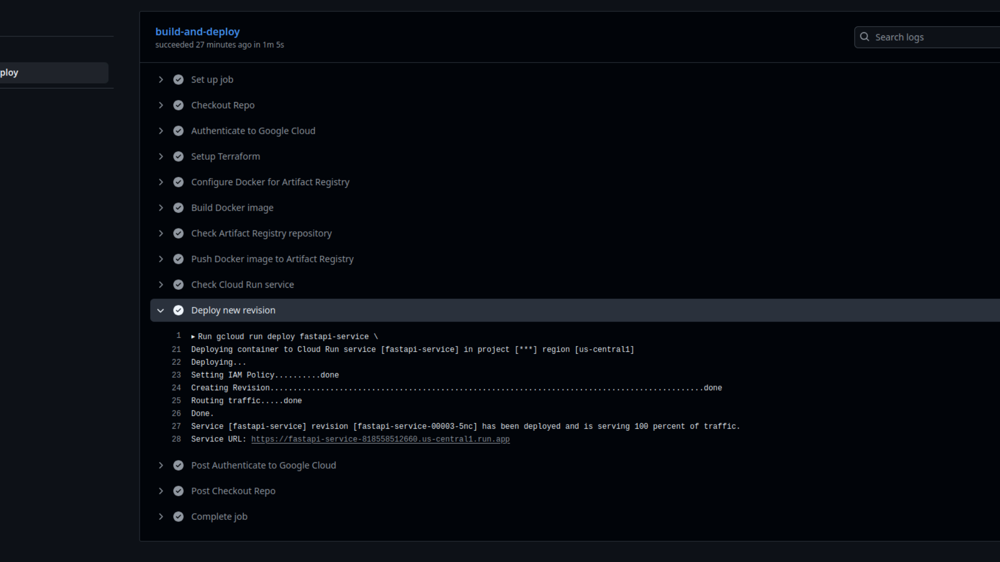

# GCP FastAPI App Deployed On Cloud Run

## 📌 Purpose
This project demonstrates how to deploy a simple FastAPI application on a Google Cloud Run using **Terraform** for infrastructure provisioning and **Docker** for containerization.  

It is designed as a hands-on DevOps showcase — from infrastructure as code (IaC) to containerized application deployment.

---

## 📌 Scope
- **Terraform**: Automates the provisioning of a Cloud Run Service with Artifact Registry on GCP.  
- **Artifact Registry**: Demonstrates a container registry usage for easy distribution.  
- **Github Actions**: CI/CD pipeline to build docker images, push it to artifact registry and deploy it on cloud run
- **Docker**: Builds and runs a containerized FastAPI application.  
- **FastAPI**: A simple Python web framework app for demonstration.  
---

## 📌 What This Shows About Me as a DevOps Engineer
- Ability to **design and automate cloud infrastructure** using Terraform.  
- Skills in **containerizing applications** with Docker for portability and reproducibility.  
- Experience in **cloud-native deployments** on GCP.  
- Proficiency in **working with container registries** (GCP Artifact Registry).  
- Hands-on understanding of **integrating IaC with application delivery pipelines**.  

---

## ⚡ Setup Instructions

### 1. Clone the Repository
```
git clone https://github.com/joeldsouza28/gcp-terraform-app.git
cd gcp-terraform-app/terraform
```


### 2. Authenticate with GCP
Make sure you are logged in with gcloud and have application default credentials configured:
```
gcloud auth login
gcloud auth application-default login
```

### 3. Initialize and Apply Terraform

```
terraform init
terraform plan
terraform apply -auto-approve
```

Note :warning: : Terraform apply will initially result in an error as we havent pushed an image yet to the artifact registry even though cloud run service has been create and is trying to refer to that image. This is okay as we will be setting an image through github actions

### 4. Setting up the CI/CD using Github Actions

#### Prerequisites:
- Setup Service Account Credentials as secrets in actions in the repository secret settings
- Setup Project Id as secrets in actions in the repository secret settings

This GitHub Actions workflow automates the CI/CD pipeline for a FastAPI app on GCP by building a Docker image, pushing it to Artifact Registry, and deploying it to Cloud Run. It triggers on pushes to the master branch, authenticates using a GCP service account, ensures the target repository and service exist, and updates Cloud Run with the latest image, allowing seamless, automated deployments of your containerized application. Once the secrets are setup you can go ahead and modify `.github/workflow/cicd.yaml` file by changing the secrets as per what you have named it




